 

> *«Production code. Non tutorial, non toy projects.»*

AI Developer e Data Analyst con base a Venezia. Costruisco sistemi LLM
pronti per la produzione — dall'ingestione dei dati alle dashboard che li
trasformano in decisioni.

 

### Profilo

Lavoro dove i modelli incontrano i dati reali: pipeline che estraggono,
strutturano e mettono in produzione. Niente prototipi da vetrina —
strumenti che restano in funzione.

 

### Competenze

**Intelligenza Artificiale**  
Pipeline LLM end-to-end · RAG · OCR · deep learning su dati reali.

**Analisi Dati**  
Dal dato grezzo alla decisione. KPI essenziali, zero rumore.

**Automazione**  
Workflow ripetitivi trasformati in script. Tempo recuperato, errori azzerati.

**Web**  
Applicazioni React rapide, minimali, dirette.

 

### Lavori selezionati

| Progetto | Descrizione |
|----------|-------------|
| **AI Invoice Extractor** | OCR e deep learning su fatture. Pipeline end-to-end con output JSON/DB strutturato. |
| **Data Analytics Dashboard** | Power BI e Qlik. Dal dato grezzo alla decisione, senza rumore. |
| **Portfolio** | React + Vite. Minimale e veloce — [riccardozozzolotto.com](https://riccardozozzolotto.com) |

 

### Strumenti

`Python` · `TensorFlow` · `scikit-learn` · `Pandas` · `Power BI`  
`React` · `Vite` · `PostgreSQL` · `MySQL` · `Git`

 

### Contatti

**Portfolio** — [riccardozozzolotto.com](https://riccardozozzolotto.com)  
**LinkedIn** — [riccardo-zozzolotto](https://www.linkedin.com/in/riccardo-zozzolotto-53aa732b1/)  
**Email** — [rzozzolotto@gmail.com](mailto:rzozzolotto@gmail.com)

 

Venezia · MMXXVI — *Less talk. More build.*
